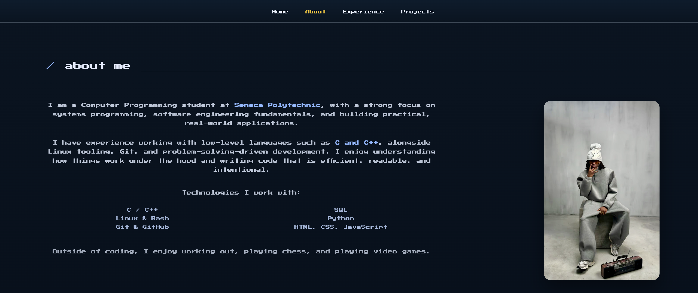

  

👋 About Me
I'm a Computer Programming student at Seneca Polytechnic with a focus on systems programming, backend development, and building things from the ground up.
This repository contains the source code for my personal website, designed as a game-inspired space to showcase my projects, experience, and how I think about software.

🎮 About This Site
The website is intentionally built with vanilla technologies:

✅ No frameworks
✅ No abstractions hiding the fundamentals
✅ Clean, readable, and honest codebase

The goal was to create something memorable while keeping the codebase clean and maintainable.

🛠️ Built With

HTML - Semantic markup
CSS - Custom styling and animations
JavaScript - Interactive elements and smooth scrolling

All styling and interactions are written by hand to maintain full control over layout, behavior, and performance.

✨ Features

🎮 Mario-inspired retro UI design
🎯 Smooth scrolling navigation
⚡ Animated interactive elements
📱 Fully responsive (mobile & desktop)
🔗 Project highlights with GitHub links
💼 Experience timeline with tabbed navigation
🎨 Custom pixel-art aesthetic

📂 Projects Highlighted
🔐 2FA Authentication App
A production-ready two-factor authentication system featuring:

Time-based one-time passwords (TOTP)
QR code enrollment
Secure token validation
Docker deployment

View Project | Live Demo
🔒 VPN Application (In Development)
Custom VPN solution with encrypted tunneling and secure connection protocols.

🚀 Running Locally
bash# Clone the repository
git clone https://github.com/ioshacker22/David.git

# Navigate to project
cd David

# Open in browser
open index.html
No build process or dependencies required!

📁 Project Structure
David/
├── assets/
│   └── images/        # Profile photos, icons
│   
├── css/
│   └── style.css      # All styling
├── js/
│   └── main.js        # Interactive functionality
└── index.html         # Main entry point

🎯 Why This Exists
This site isn't meant to be flashy for the sake of it. It exists to:
✅ Demonstrate how I structure projects
✅ Show my comfort with web fundamentals
✅ Reflect curiosity and intentional design choices
✅ Provide a memorable experience for visitors

🌐 Live Site
Visit: https://ioshacker22.github.io/David/

📬 Contact

Email: Davidadebambo22@gmail.com
LinkedIn: www.linkedin.com/in/david-adebambo-8b2a41277
GitHub: @ioshacker22

📄 License
This project is licensed under the MIT License - see the LICENSE file for details.

🙏 Acknowledgments

Mario Bros theme inspiration from Nintendo
Font: "Press Start 2P" from Google Fonts
Hosted on GitHub Pages

⭐ If you like this project, please consider giving it a star!
Made with ❤️ by David Adebambo

